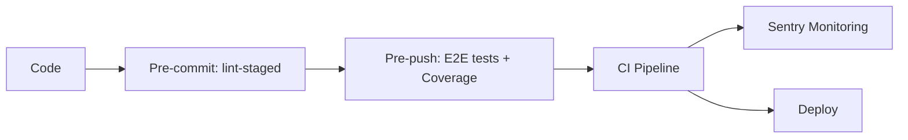

# SvelteKit Supabase Starter Template

A production-ready SvelteKit starter template with Supabase authentication, built with shift-left quality practices. Catch bugs early, ship with confidence.

## Philosophy

This template embraces the **shift-left** methodology—integrating quality gates at every stage of development rather than catching issues in production. Every commit is linted, every push is tested, and every merge is validated through CI/CD.

**Fail fast, fix early.**

## Quality Gates



| Stage | Trigger | Actions |
|-------|---------|---------|
| Pre-commit | `git commit` | Prettier + ESLint on staged files |
| Pre-push | `git push` | Full Playwright E2E test suite with coverage |
| CI/CD | Push/PR to main | Lint, type-check, test, build |
| Runtime | Production | Sentry error tracking & performance monitoring |

## Technologies

**Core**
- SvelteKit
- TypeScript
- Vite

**Authentication**
- Supabase Auth
- Email/Password authentication
- OAuth providers (Google, Facebook)

**Styling**
- Tailwind CSS v4
- Bits UI
- Tailwind Merge & Variants

**Quality**
- ESLint & Prettier
- Playwright (E2E)
- Monocart Reporter (V8 Code Coverage)
- Husky (Git hooks)
- lint-staged

**Observability**
- Sentry (Error tracking & Performance monitoring)

**Validation**
- Zod
- Superforms

**HTTP**
- Axios

## Getting Started

Install dependencies:

```bash
pnpm install
```

Start the development server:

```bash
pnpm dev
```

Build for production:

```bash
pnpm build
```

Preview the production build:

```bash
pnpm preview
```

## Authentication

This template includes a complete Supabase authentication system with the following features:

**Authentication Methods**
- Email/Password authentication with signup and login
- OAuth providers (Google, Facebook)
- Automatic email verification via Supabase

**Protected Routes**
- Routes under `/protected/*` require authentication
- Automatic redirect to `/login` for unauthenticated users
- Auth middleware handles session management via server hooks

**Session Management**
- Server-side session handling using `@supabase/ssr`
- Cookie-based authentication
- User and session data available in `event.locals`
- Client-side Supabase client for real-time subscriptions

**Available Routes**
- `/login` - Email/password login and OAuth sign-in
- `/signup` - User registration with email verification
- `/auth/callback` - OAuth callback handler
- `/auth/logout` - POST endpoint to sign out
- `/protected` - Example protected page (requires authentication)

**Setup**

1. Create a Supabase project at [supabase.com](https://supabase.com)
2. Configure your OAuth providers in the Supabase dashboard (optional)
3. Add your Supabase URL and anon key to `.env`:
   ```
   PUBLIC_SUPABASE_URL=your-supabase-project-url
   PUBLIC_SUPABASE_ANON_KEY=your-supabase-anon-key
   ```

## Commands

| Command | Description |
|---------|-------------|
| `pnpm dev` | Start development server |
| `pnpm build` | Build for production |
| `pnpm preview` | Preview production build |
| `pnpm check` | Run type checks |
| `pnpm lint` | Lint and check formatting |
| `pnpm format` | Format code with Prettier |
| `pnpm test` | Run E2E tests |
| `pnpm test:show-report` | Open Monocart test report |
| `pnpm coverage:show-report` | Open V8 coverage report |

## Code Coverage

E2E tests collect V8 code coverage using Playwright's built-in coverage API and Monocart Reporter.

**Report Formats**
- V8 HTML Report: `./coverage/e2e/v8/index.html`
- LCOV: `./coverage/e2e/lcov/code-coverage.lcov.info`
- Cobertura XML: `./coverage/e2e/cobertura/code-coverage.cobertura.xml`

## Environment Variables

Create a `.env` file with the following variables (see `.env.dist` for a template):

```
# API
VITE_API_BASE_URL=your-base-api

# Supabase
PUBLIC_SUPABASE_URL=your-supabase-project-url
PUBLIC_SUPABASE_ANON_KEY=your-supabase-anon-key

# Sentry
VITE_SENTRY_DSN=your-sentry-dsn
SENTRY_DSN=your-sentry-dsn
SENTRY_ORG=your-sentry-org
SENTRY_PROJECT=your-sentry-project
SENTRY_AUTH_TOKEN=your-sentry-auth-token
```

## CI/CD Pipeline

GitHub Actions workflow triggers on push and pull requests to main:

1. Install dependencies (pnpm)
2. Run linter and formatter checks
3. Run TypeScript type checks
4. Install Playwright browsers
5. Execute E2E test suite
6. Build the application
